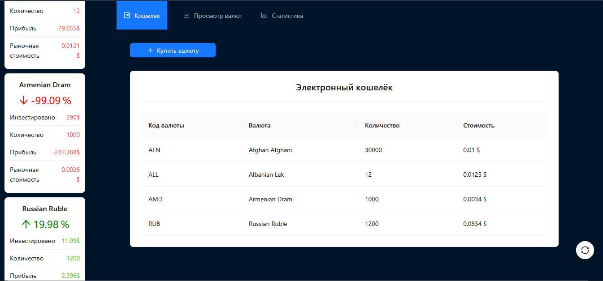
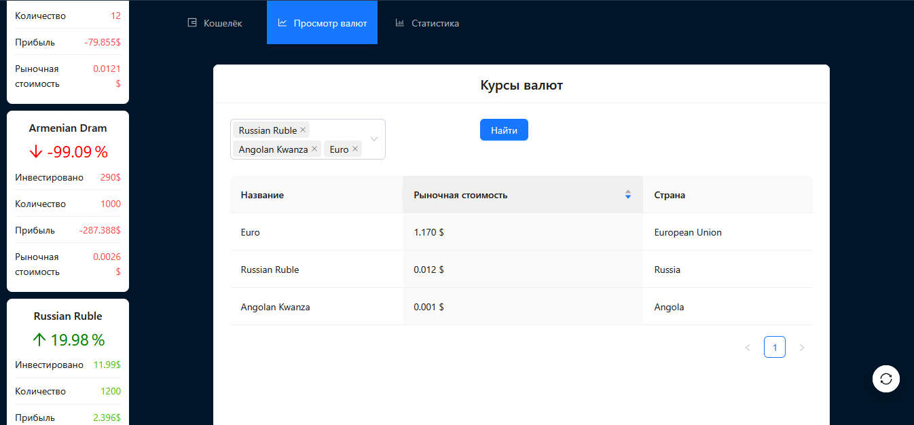
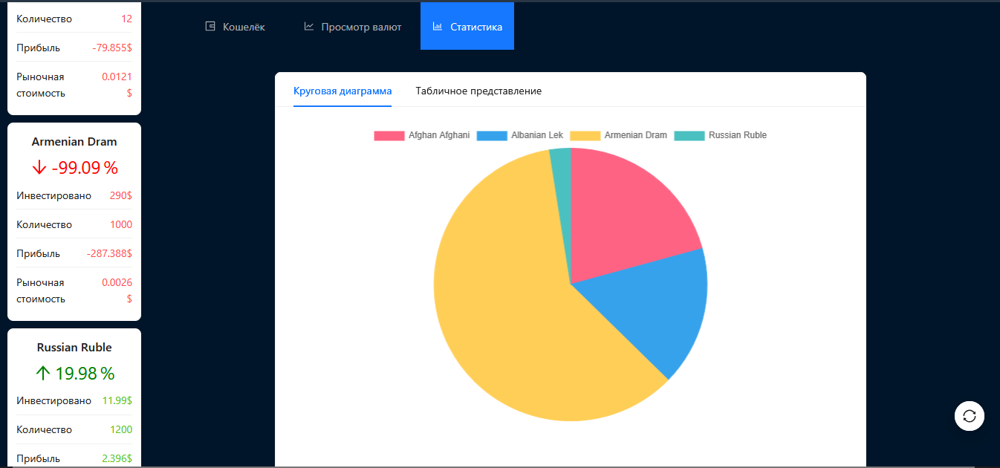
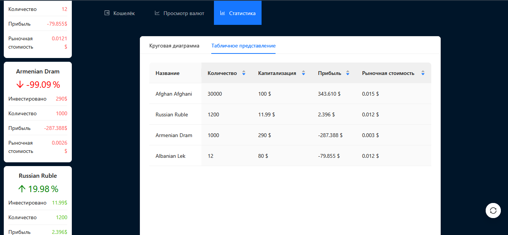

# Пет-проект сайт электронный кошелёк
-----
## Основные функции
- Просмотр актуальных валют через Exchange Rate Api
- Визуализация статистики
- Добавление валют в кошелёк

## Технологии
- React
- Typescript
- AntD
- React-Router

> Функционал ограничен тестовыми данными

## Скриншоты сайта

